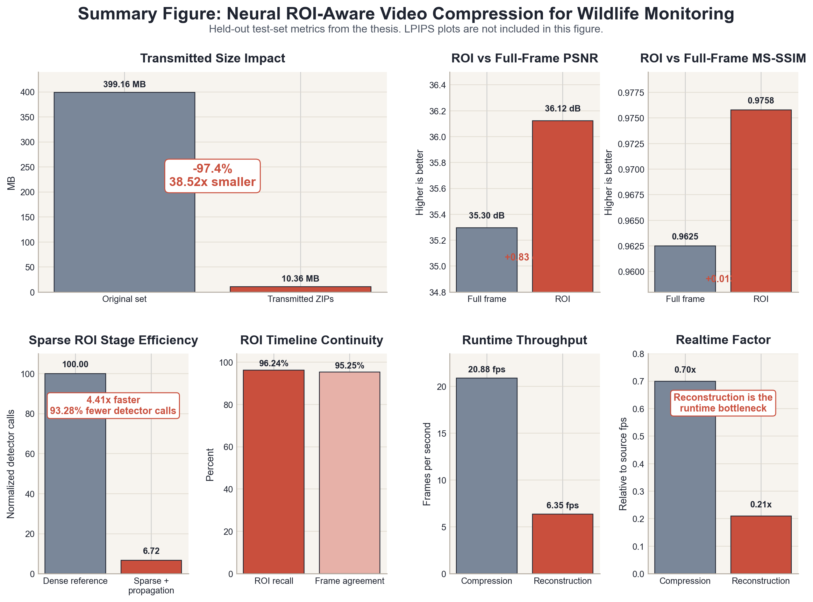

# Neural ROI-Aware Video Compression for Wildlife Monitoring Under Edge Constraints

This repository contains the code for a master's thesis pipeline that compresses wildlife video by prioritizing the animal region of interest (ROI) over the background. The pipeline combines sparse ROI generation, dual-timeline frame selection, learned compression, and archive-only reconstruction.

## Pipeline Overview

The pipeline performs the following steps:

1. detect or propagate animal ROIs sparsely instead of running dense detection on every frame
2. keep ROI and background on separate timelines
3. compress ROI and background streams independently
4. package the transmitted result into a single archive
5. reconstruct the video from that archive

Main entry points:

- `run_compression.py`
- `run_decompression.py`

## Key Results

Held-out test-set results reported in the thesis:

- aggregate transmitted-size reduction: `97.4%`
- aggregate compression ratio: `38.52x`
- detector-call reduction in the sparse ROI stage: `93.28%`
- ROI-stage speedup versus dense detection: `4.41x`
- mean ROI PSNR: `36.12 dB`
- mean ROI MS-SSIM: `0.9758`

Additional result files:

- [docs/RESULTS_SUMMARY.md](docs/RESULTS_SUMMARY.md)
- [docs/project_summary.md](docs/project_summary.md)
- [docs/dataset_and_eval.md](docs/dataset_and_eval.md)

## Reproducibility

The repository was validated on a Windows GPU setup with the following controls:

- locked package versions in [docker/requirements.gpu.txt](docker/requirements.gpu.txt)
- pinned `pip`, `torch`, and `torchvision` versions in the setup commands
- SHA256-verified model downloads via [docs/model_checksums.sha256](docs/model_checksums.sha256)
- recorded smoke-test environment and hashes in [docs/reproducibility_validation.md](docs/reproducibility_validation.md)

Validated environment snapshot:

- Windows `10.0.26200.8037`
- Python `3.12.0`
- PyTorch `2.10.0+cu126`
- `NVIDIA GeForce RTX 3070 Ti Laptop GPU`

## Figures

The repository stores a subset of thesis figures under [docs/figures/](docs/figures/). These include pipeline diagrams, ROI-stage metrics, runtime figures, qualitative examples, and a summary figure derived from the thesis metrics.



Figure file list:

- [docs/figures/README.md](docs/figures/README.md)

## Repository Layout

Top-level structure:

- `configs/`
- `src/`
- `scripts/`
- `tests/`
- `docker/`
- `DCVC/`
- `_third_party_amt/`
- `run_compression.py`
- `run_decompression.py`

Additional repository notes:

- [docs/REPOSITORY_STRUCTURE.md](docs/REPOSITORY_STRUCTURE.md)

## Files Not Stored In Git

The repository does not store large runtime assets or evaluation data:

- dataset videos
- downloaded model weights
- generated archives
- reconstructed videos
- experiment outputs

Expected local working directories:

- `data/`
- `models/`
- `outputs/`

## Required Model Files

Required files in `models/`:

- `MDV6-yolov9-c.pt`
- `cvpr2025_image.pth.tar`
- `cvpr2025_video.pth.tar`
- `amt-s.pth` if AMT interpolation is enabled

Optional model file:

- `MDV6-yolov9-c.onnx`

Download helper:

```bash
python scripts/download_models.py
```

The download script verifies every model against [docs/model_checksums.sha256](docs/model_checksums.sha256).

## Quick Start

### 1. Create local working directories

```bash
mkdir -p data models outputs
```

Windows PowerShell:

```powershell
New-Item -ItemType Directory -Force data, models, outputs
```

### 2. Set up the environment

Linux or macOS:

```bash
python3 -m venv venv
source venv/bin/activate
python -m pip install --upgrade pip==26.0.1 setuptools==82.0.0 wheel==0.46.3
pip install --index-url https://download.pytorch.org/whl/cu126 torch==2.10.0+cu126 torchvision==0.25.0+cu126
pip install -r docker/requirements.gpu.txt
cd DCVC/src/cpp
pip install --no-build-isolation .
cd ../layers/extensions/inference
pip install --no-build-isolation .
cd ../../../..
```

Windows PowerShell:

```powershell
python -m venv venv
.\venv\Scripts\Activate.ps1
python -m pip install --upgrade pip==26.0.1 setuptools==82.0.0 wheel==0.46.3
pip install --index-url https://download.pytorch.org/whl/cu126 torch==2.10.0+cu126 torchvision==0.25.0+cu126
pip install -r docker\requirements.gpu.txt
cd DCVC\src\cpp
pip install --no-build-isolation .
cd ..\layers\extensions\inference
pip install --no-build-isolation .
cd ..\..\..\..
```

### 3. Download models

```bash
python scripts/download_models.py
```

### 4. Run compression

```bash
python run_compression.py data/tune/video.mp4 --config configs/gpu/compression.yaml --output outputs/video.zip
```

### 5. Run decompression

```bash
python run_decompression.py outputs/video.zip --config configs/gpu/decompression.yaml --output outputs/video_reconstructed.mp4
```

## Sanity Checks

Stage-level sanity scripts:

- ROI detection

```bash
python scripts/test_roi_detection.py --config configs/gpu/compression.yaml --video data/tune/video.mp4
```

- Frame removal

```bash
python scripts/test_frame_removal.py --config configs/gpu/compression.yaml --video data/tune/video.mp4
```

- Compression

```bash
python scripts/test_compression.py --config configs/gpu/compression.yaml --video data/tune/video.mp4 --repeat 2
```

- Decompression

```bash
python scripts/test_decompression.py outputs/video.zip --config configs/gpu/decompression.yaml --repeat 1
```

More details:

- [scripts/README.md](scripts/README.md)

## Docker

Build:

```bash
docker build -f docker/Dockerfile.gpu -t edge-roi-gpu .
```

Run:

```bash
docker compose -f docker/compose.gpu.yaml run --rm pipeline-gpu
```

Default compose paths:

- input video: `data/tune/video.mp4`
- output archive: `outputs/video.zip`
- reconstructed video: `outputs/video_reconstructed.mp4`

## Scope

The repository does not claim:

- universal superiority over every baseline on every metric
- CPU-friendly runtime
- production-ready deployment on all edge hardware
- bundled reproduction of the full thesis dataset

The thesis result reported here is narrower:

an ROI-priority wildlife video pipeline can reduce transmitted size substantially while preserving the animal region better than treating the whole frame uniformly, under practical edge-oriented constraints.
